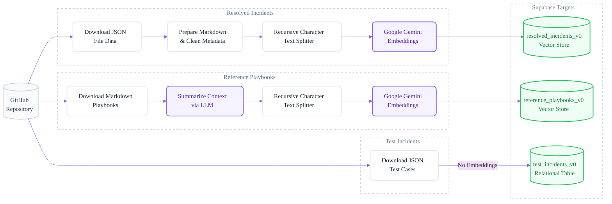
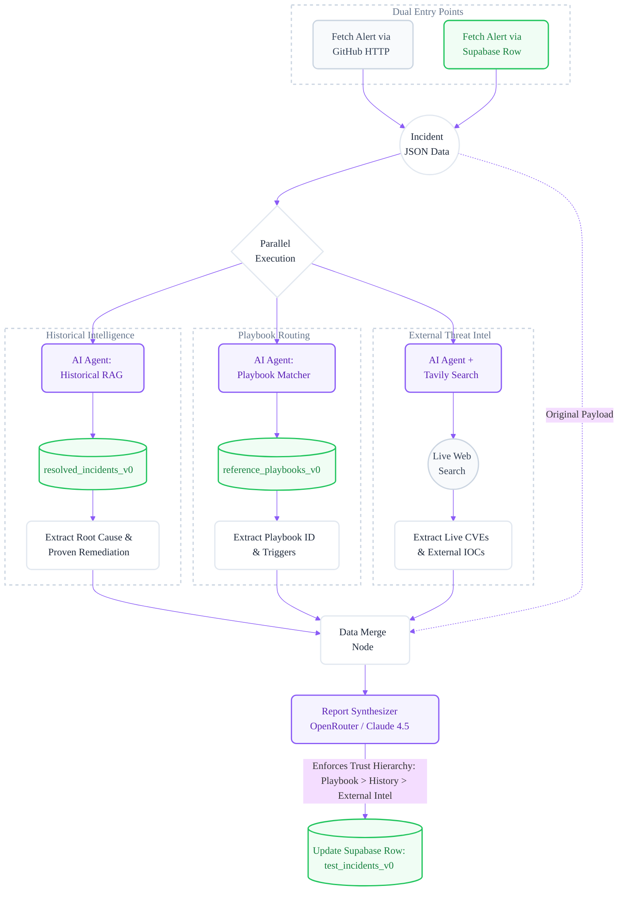

# AI-Powered Incident Response Report Generator

> Generate a structured, source-attributed incident response report — with MITRE mapping, IOCs, severity calibration, and immediate action steps — within seconds of an alert firing. No manual playbook lookup, no hunting through past incidents, no Googling CVEs. The system does all three in parallel.

**[📥 Import n8n Template](https://automate.deployed.top/workflow/8iISUo0cY0KdNNE4)** · Built with n8n · Supabase · Google Gemini · OpenRouter · Tavily

---

## How It Works

### Ingestion Pipeline

Run these three ingestion workflows once (in any order) to seed your vector store:



> After all three ingestion pipelines complete, run `SELECT refresh_metadata_values_v0();` in your Supabase SQL editor to populate the metadata discovery table.

---

### Retrieval & Report Generation Pipeline

When a test incident is triggered, the workflow fans out into **three parallel retrieval branches**, merges the results, and synthesises a final report:



**Content trust hierarchy in the Synthesizer:** Playbook → Past incidents → External intel → General LLM reasoning. This ordering is enforced in the system prompt to minimise hallucination.

---

## Tech Stack

| Layer                 | Tool                                                         | Detail                                                  |
| --------------------- | ------------------------------------------------------------ | ------------------------------------------------------- |
| Orchestration         | [n8n](https://n8n.io)                                        | Self-hostable, all logic is visual                      |
| Vector DB             | [Supabase](https://supabase.com) + pgvector                  | 3 tables: playbooks, resolved incidents, test incidents |
| Embeddings            | Google Gemini `gemini-embedding-001`                         | 3072-dim vectors                                        |
| Retrieval agents      | OpenRouter (any model)                                       | Playbook selection + historical similarity scoring      |
| Synthesizer LLM       | OpenRouter (any model)                                       | Final structured report generation                      |
| External threat intel | OpenRouter (any model) + [Tavily Search](https://tavily.com) | Real-time CVE / threat actor / advisory lookup          |
| Data hosting          | GitHub                                                       | All source data files live in this repo                 |

---

## What's in This Repo

```text
├── README.md                      # This documentation file
├── Incident_Management_V0.json    # The n8n workflow template file
├── supabase_schema_v0.sql         # DB setup — run once
├── Reference Playbooks/           # 4 playbooks (brute force, phishing, phishing-campaign, S3 access)
├── Resolved Incidents/            # Past incident JSON — seeded into the vector store
├── Test Incidents/                # 13 synthetic test cases (data exfiltration, DDoS, ransomware, ...)
```

---

## Quickstart

### Prerequisites

| Account                                         | Purpose                 | Free?                           |
| ----------------------------------------------- | ----------------------- | ------------------------------- |
| [Supabase](https://supabase.com)                | Vector DB + row storage | ✅ Yes                          |
| [Google AI Studio](https://aistudio.google.com) | Gemini embeddings       | ✅ Yes (rate limits apply)      |
| [OpenRouter](https://openrouter.ai)             | LLM calls               | Pay-per-token                   |
| [Tavily](https://tavily.com)                    | Threat intel search     | ✅ 1,000 free searches/month    |
| [n8n](https://n8n.io)                           | Workflow engine         | ✅ Self-host free / cloud trial |

---

### Step 1 — Database Setup

Run `supabase_schema_v0.sql` in your Supabase SQL editor. This creates:

- `resolved_incidents_v0` — vector store for past incidents
- `reference_playbooks_v0` — vector store for playbooks
- `test_incidents_v0` — structured table for incoming alerts and generated reports
- `metadata_values_v0` — tracks distinct metadata field values (used for optional metadata filtering)
- Helper functions: `match_resolved_incidents_v0`, `match_reference_playbooks_v0`, `refresh_metadata_values_v0`

> **Note:** The `SELECT refresh_metadata_values_v0()` call at the end of the schema is a placeholder. Run it **after** completing Step 3 (data ingestion), not during initial schema setup.

---

### Step 2 — Import the n8n Workflow

Import the template: **[https://automate.deployed.top/workflow/8iISUo0cY0KdNNE4](https://automate.deployed.top/workflow/8iISUo0cY0KdNNE4)**

Then add four credentials in n8n (**Settings → Credentials**):

| Credential        | Used for                                   |
| ----------------- | ------------------------------------------ |
| Supabase API      | DB reads/writes + vector store             |
| Google Gemini API | Embedding generation                       |
| OpenRouter API    | LLM calls (retrieval agents + synthesizer) |
| Tavily API        | External threat intel search               |

---

### Step 3 — Ingest Data

The workflow contains three separate ingestion pipelines, each triggered manually:

1. **Ingest Resolved Incidents** — fetches `Resolved Incidents/` from GitHub → embeds → writes to `resolved_incidents_v0`
2. **Ingest Reference Playbooks** — fetches `Reference Playbooks/` from GitHub → summarises → embeds → writes to `reference_playbooks_v0`
3. **Ingest Test Incidents** — fetches `Test Incidents/` from GitHub → writes (no embedding) to `test_incidents_v0`

After all three complete, run this once in Supabase SQL editor:

```sql
SELECT refresh_metadata_values_v0();
```

This populates `metadata_values_v0` with all distinct field values from your resolved incidents — severity levels, incident types, affected systems, MITRE IDs, etc. Required only if you plan to enable optional metadata filtering.

---

### Step 4 — Trigger a Report

Two modes are supported:

**Mode A — GitHub-direct** _(simpler, no Supabase row needed)_
Trigger the retrieval workflow with a test incident ID (e.g. `Test-data_exfiltration-001.json`). The workflow fetches the incident JSON directly from GitHub and runs the full pipeline.

**Mode B — Supabase-loop** _(recommended for evaluation)_
After ingesting test incidents (Step 3), trigger the Supabase-based retrieval path. The workflow fetches the incident row from `test_incidents_v0`, runs the pipeline, and writes the generated report back to the `output` column of the same row. This lets you compare all 13 outputs in one place.

---

## LLM Configuration

The default model is **Opus 4.5** (`anthropic/claude-opus-4.5`) via OpenRouter. Change it in the model selector of any node — no other code changes required.

**Recommended models:**

| Type          | Model                         |
| ------------- | ----------------------------- |
| Closed source | `anthropic/claude-sonnet-4.5` |
| Closed source | `anthropic/claude-opus-4.5`   |
| Closed source | `openai/gpt-5.2`              |
| Closed source | `google/gemini-3-pro-preview` |
| Open source   | `moonshotai/kimi-k2.5`        |
| Open source   | `qwen/qwen3.5-plus-02-15`     |
| Open source   | `z-ai/glm-4.7`                |

---

## Optional: Metadata Filtering

By default, the historical incidents retrieval runs **without metadata filters** (pure semantic similarity). The workflow also contains an alternative retrieval path **with metadata filtering** — currently disabled.

To switch:

1. In n8n, locate the `Historical Incidents RAG` branch
2. Disable the no-filter node, enable the metadata-filter node
3. The metadata filter agent will use `metadata_values_v0` to dynamically select relevant filters (e.g., match only incidents of the same `type` or `severity`)

This path becomes more effective as your resolved incidents dataset grows (100+ incidents is a reasonable starting point for meaningful metadata filtering).

---

## Customisation

- **Add playbooks** — drop a Markdown file into `Reference Playbooks/`, re-run the playbook ingestion workflow
- **Add real incidents** — ingest resolved incidents from your SIEM or ticketing system using the same JSON schema as `Resolved Incidents/`
- **Edit the report format** — the Synthesizer system prompt is in `Prompts/Final Synthesizer System Prompt`; every section and rule is documented inline
- **Enrich historical data** — the `remediation_actions` field in resolved incidents directly powers the "What Worked" section; more specific data here = more useful reports

---

## Known Limitations

- **Not a production SOAR** — no native ticketing integration (Jira, PagerDuty, ServiceNow) out of the box
- **4 specific playbooks** — brute force, phishing, S3 data access, phishing campaign. All other incident types fall back to the generic playbook
- **Synthetic resolved incidents** — the sample `Resolved Incidents/` data has generic `remediation_actions` fields. Replacing these with real incident data from your environment will significantly improve the "What Worked" section of the report
- **Evaluated on 13 test cases** — avg score 9.35/10 across the test set; not a formal benchmark on production data

---

## Evaluation

13 synthetic test cases covering: data exfiltration, DDoS, error spike, leaked credentials, malware, memory leak, phishing, policy violation, prompt injection, ransomware, service outage, C2/network anomaly, and vulnerable dependency (Log4Shell).

Average score: **9.35 / 10** across all test cases.
